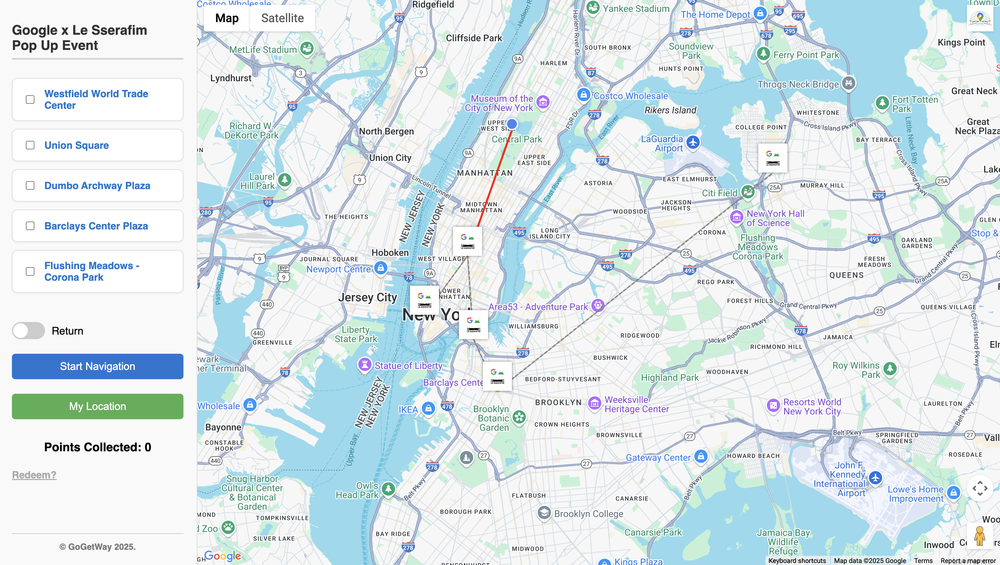
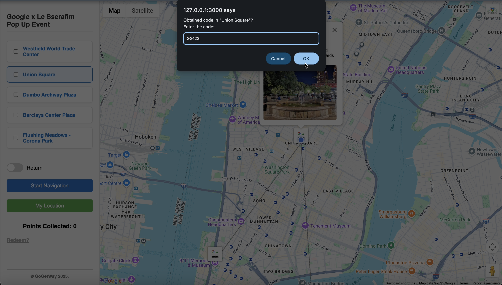
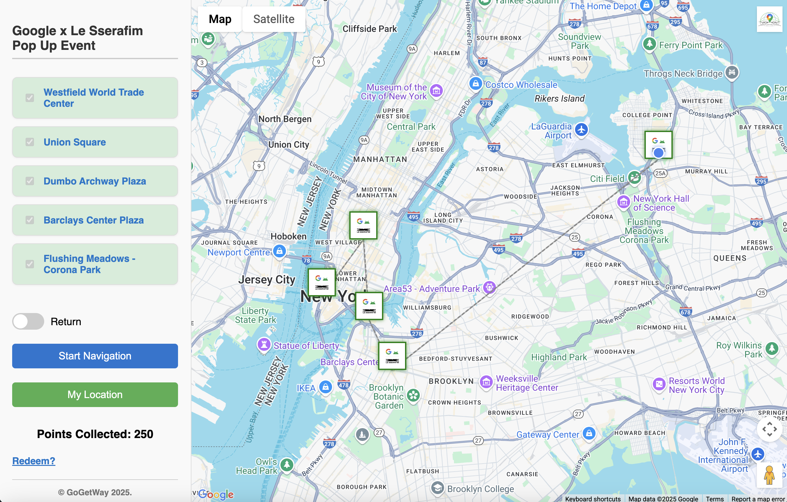
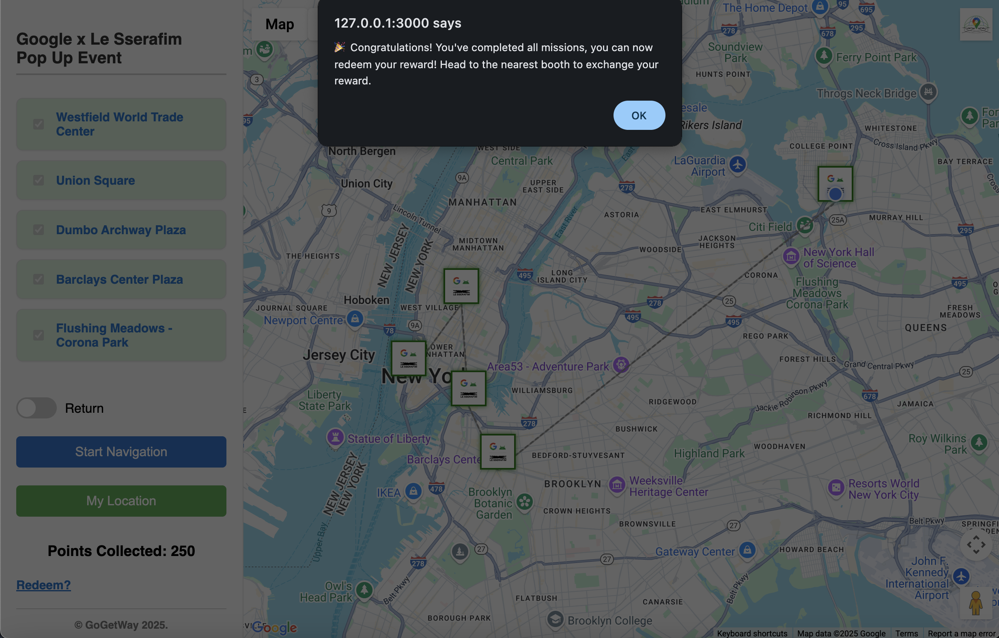
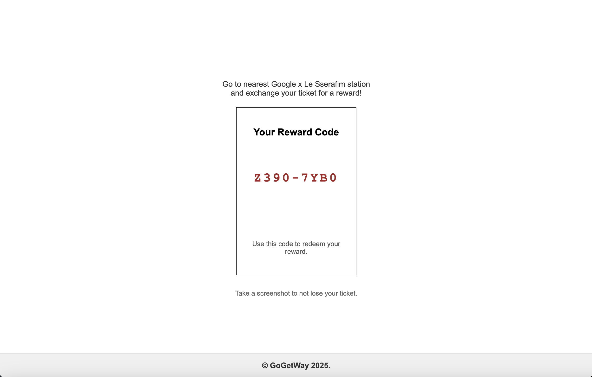

# GoGetWay

<em>Go now, Get rewarded, and know your Way.</em>

GoGetWay is a web application that lets you view your event’s location, not one but all. Designed to enhance event experiences, every event location is pinned on the map to ease your event day trip. Complete all missions and redeem your reward.

To start the application, please ensure you replace the script source in the <em>index.html</em> file with a valid Google Maps API key.

Two application samples are available:
1. GoGetWay-main = Landmark event (guidance type: itinerary/scheduled destination).
2. GoGetWay-Google-LeSserafim = Pop-up event (guidance type: nearest destination).

## Prototype
**Event Locations**

**Location Details**

**Mission/Quiz**

**Completed Missions**
(Green = Completed.)

**Reward**
(Only when all the mission/quizzes are completed.)

